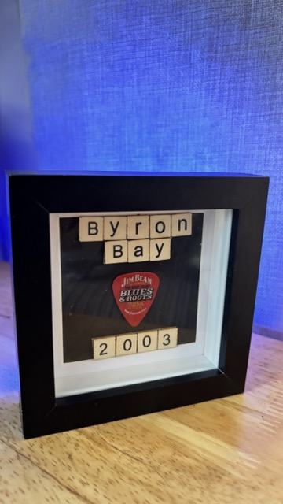

## What you will make

Add colourful notifications to a photo-frame, so you can keep in touch with your friends!

--- print-only ---

{:width="270px"}

--- /print-only ---

### You will need:

**For each friend frame**:

- ESP32 or ESP8266 microprocessor
- RGB LED
- 2 x Touch capacitive sensors
- 3 x 330 ohm resistors
- Socket to pin jumper cables
- Breadboard
