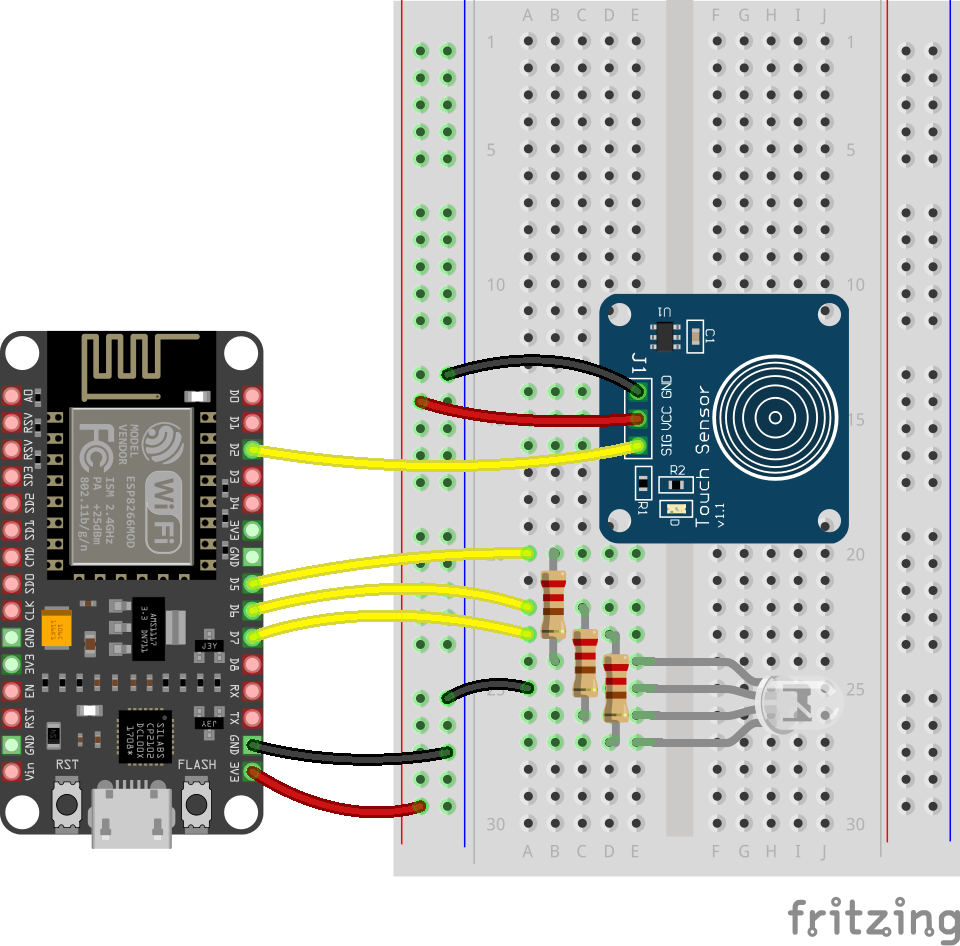
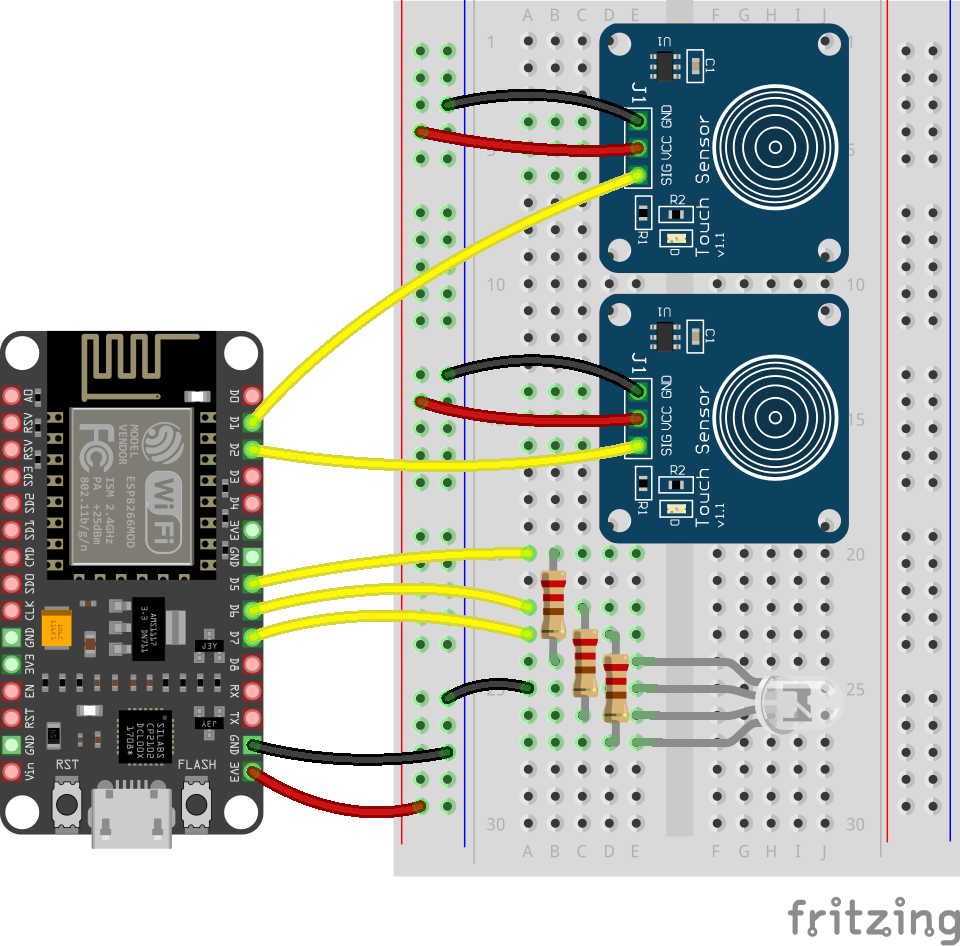

## Challenge

Let the user 'clear' the LED and 'send' notifcations to ntfy so that other friend frames can receive them.

### Touch to clear

The frame can have a 'Clear' touch sensor.

When you touch the sensor, the RGB LED should turn off.

### Connect the capacitive touch sensor

--- task ---

- Connect the RGB LED's GND pin to the breadboard's ground rail.
- Connect the microcontroller's GND pin to the breadboard's ground rail.
- Connect the microcontroller's 3V pin to the breadboard's positive rail.
- Connect a capacitive touch sensor's output pin to GPIO `Pin 5` (D2) on the microcontroller.
- Connect the capacitive touch sensor's VCC pin to the breadboard's positive rail.
- Connect the capacitive touch sensor's GND pin to the breadboard's ground rail.

{:width="450px"}

--- /task ---

### Add code to control what happens when the sensor is touched.

--- task ---

Import the TouchPad helper and the time library.

--- code ---
---
language: python
line_numbers: true
line_number_start: 1
line_highlights: 1,2
---
from helper import LED, WiFi, Ntfy, Touchpad
import time

--- /code ---

--- /task ---

--- task ---

Set up the touch sensor as `clear_pad`.

--- code ---
---
language: python
line_numbers: true
line_number_start: 1
line_highlights: 11
---
from helper import LED, WiFi, Ntfy, Touchpad
import time

WIFI_SSID = "alice_ssid"
WIFI_PASS = "alice_pass"
TOPIC = "your-topic"
MY_DEVICE = "alice"       # Use "rajib" on your friend's frame
FRIEND_DEVICE = "rajib"   # Use "alice" on your friend's frame

led = LED(r=15, g=13, b=12)
clear_pad = Touchpad(5)

--- /code ---

--- /task ---

--- task ---

Turn the LED off when the sensor is touched.

--- code ---
---
language: python
line_numbers: true
line_number_start: 20
line_highlights: 21-22
---
while True:
    if clear_pad.pressed():
        led.off()
    
    message = ntfy.poll_message()
    if message:
        message_text = message[1]
        if message_text == FRIEND_DEVICE:
            led.on("green")
    time.sleep(0.05)
--- /code ---

--- /task ---

### Touch to send

Give the frame a 'Send' touch sensor.

When touched, a message is sent to ntfy with the ID of the sending device.

### Connect a second capacitive touch sensor

--- task ---

- Connect the second capacitive touch sensor's output pin to GPIO `Pin 4` (D1) on the microcontroller.
- Connect the capacitive touch sensor's VCC pin to the breadboard's positive rail.
- Connect the capacitive touch sensor's GND pin to the breadboard's ground rail.

{:width="450px"}

--- /task ---

### Add code to control what happens when the second sensor is touched.

--- task ---

Set up the touch sensor as `send_pad`.

--- code ---
---
language: python
line_numbers: true
line_number_start: 1
line_highlights: 12
---
from helper import LED, WiFi, Ntfy, Touchpad
import time

WIFI_SSID = "alice_ssid"
WIFI_PASS = "alice_pass"
TOPIC = "your-topic"
MY_DEVICE = "alice"       # Use "rajib" on your friend's frame
FRIEND_DEVICE = "rajib"   # Use "alice" on your friend's frame

led = LED(r=15, g=13, b=12)
clear_pad = Touchpad(5)
send_pad = Touchpad(4)

--- /code ---

--- /task ---

--- task ---

Blink the LED and send MY_DEVICE ("alice") to ntfy when the sensor is touched.

--- code ---
---
language: python
line_numbers: true
line_number_start: 20
line_highlights: 24-26
---
while True:
    if clear_pad.touched():
        led.off()

    if send_pad.touched():
        led.blink("cyan")
        ntfy.send(MY_DEVICE)
    
    message = ntfy.poll_message()
    if message:
        message_text = message[1]
        if message_text == FRIEND_DEVICE:
            led.on("green")
    time.sleep(0.05)
--- /code ---

--- /task ---

--- task ---

**Your frame**:
- Stick the touchpads to the sides of your frame. You can label them if you want.

**Your friend's frame**:
- Stick the touchpads on and give it to your friend.

--- /task ---

--- task ---

**Test**: 
- Power up both devices.
The RGB LEDs should blink blue when connected to WiFi.

- Press the 'send' touchpad on your frame.
Your RGB LED should blink cyan and your **friend's** RGB LED should turn green.

- Press the 'clear' touch pad on your friend's frame.
Your **friend's** RGB LED should turn **off**.

- Press the 'send' touchpad on your **friend's** frame.
Your **friend's** RGB LED should blink cyan and your RGB LED should turn green.

- Press the 'clear' touch pad on your frame.
Your RGB LED should turn **off**.

--- /task ---