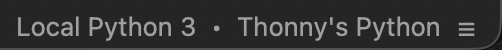
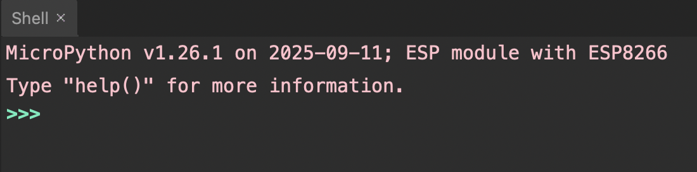

## Add the MicroPython firmware

--- task ---

Connect your ESP32 or ESP8266 board to your computer.

--- /task ---

--- task ---

Open Thonny.

--- /task ---

--- task ---

Go to Tools > Options > Interpreter.

--- /task ---

--- task ---

Select the interpreter you want to use (e.g. `Micropython (ESP8266)`).

Then select the Port your board is connected to (e.g. `USB Serial @ dev/cu.usbserial-11120`).

--- /task ---

--- task ---

Click 'Install or update MicroPython'.

--- /task ---

--- task ---

Select the Target port (the same port you chose before).

--- /task ---

--- task ---

Choose the MicroPython family and variant that matches your ESP board.

--- /task ---

--- task ---

Choose the latest version.

--- /task ---

--- task ---

Click 'Install'.

--- /task ---

In the bottom right corner of the Thonny window, you will see the interpreter used to run the code you write in Thonny.

By default, Thonny uses the interpreter on the 'Local' computer (the one running Thonny).

--- task ---

Click the Python interpreter and select MicroPython.

--- /task ---

You will see this message and the REPL prompt `>>>` in the Shell:

