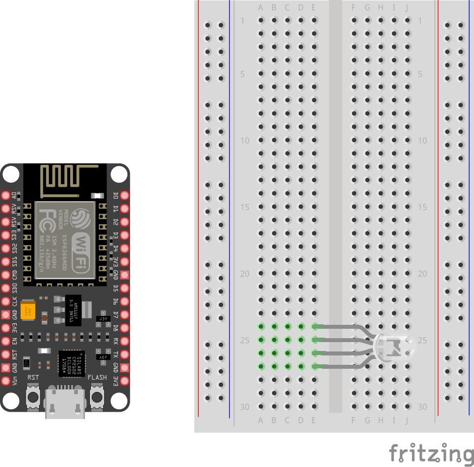
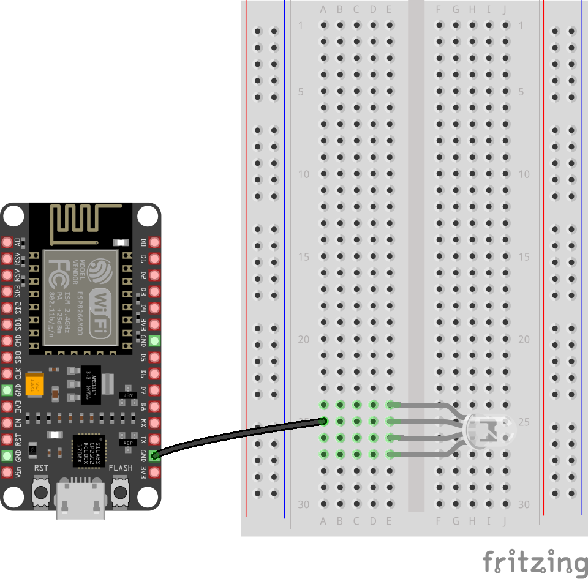
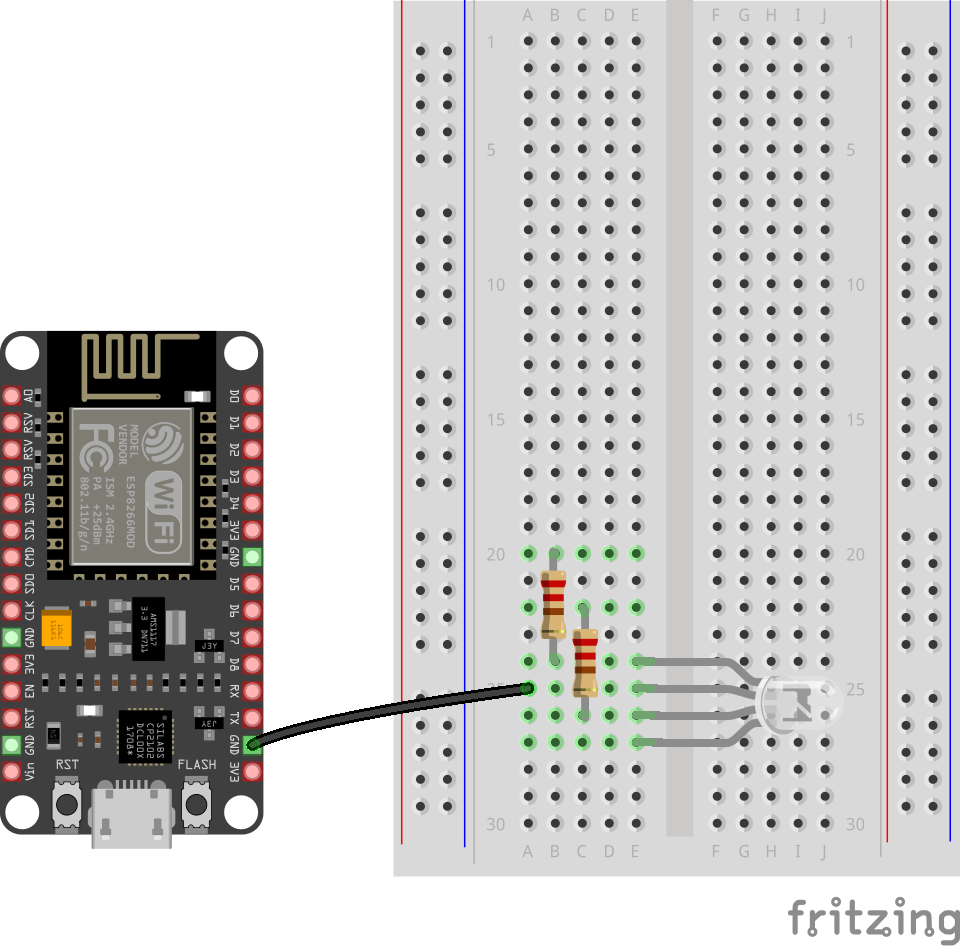
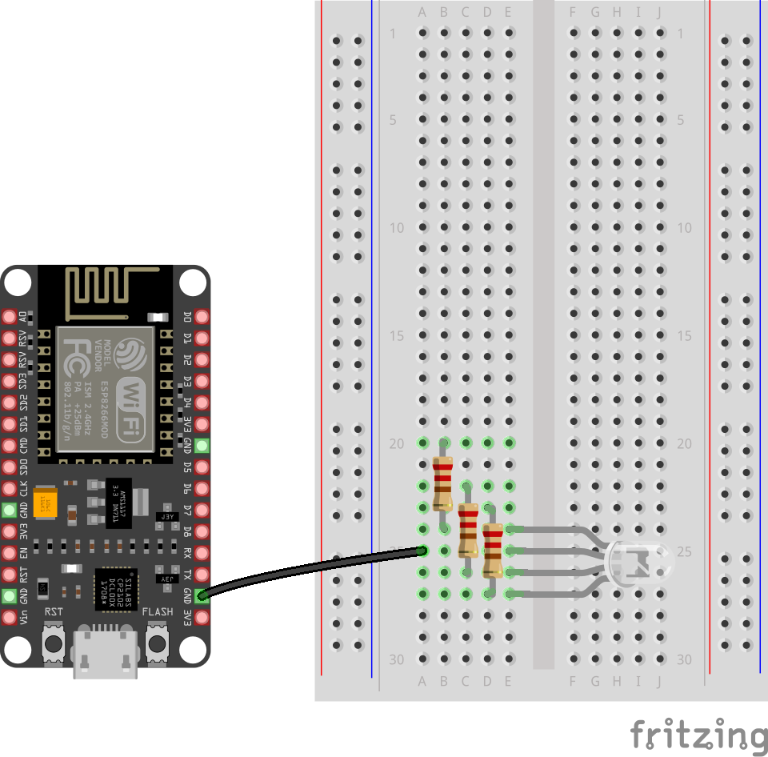
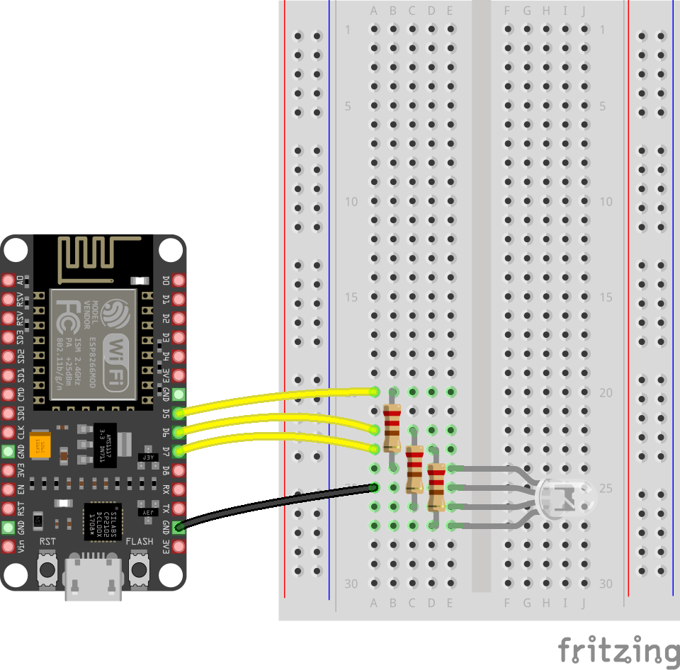
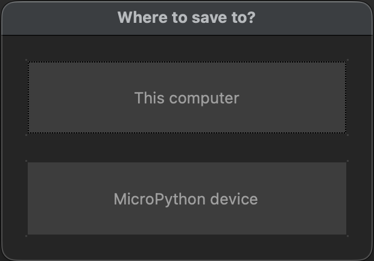

## RGB LED

An RGB LED has four legs.


--- task ---

Add the RGB LED to the breadboard in **column E**, so that each leg sits in its own row.

The second leg from the top should be the longest leg.

{:width="450px"}

--- /task ---

--- task ---

Connect the GND pin on your microcontroller to the same row as the GND leg of the RGB LED.

{:width="450px"}

--- /task ---

--- task ---

Add a resistor to **column B**. 

In our example, it connects the Red leg on row 24 to row 20.

{:width="450px"}

--- /task ---

--- task ---

Add another resistor to **column C**. 

In our example, it connects the Green leg on row 26 to row 22.

{:width="450px"}

--- /task ---

--- task ---

Add a resistor to **column D**. 

In our example, it connects the Blue leg on row 27 to row 23.

{:width="450px"}

--- /task ---

--- task ---

Use jumper cables to connect the resistors to the microcontroller pins. 

- 'Red' resistor    >> Pin D5 (GPIO 15)
- 'Green' resistor  >> Pin D6 (GPIO 13)
- 'Blue' resistor   >> Pin D7 (GPIO 12)

{:width="450px"}

--- /task ---

### Download the starter project

--- task ---

Download the [starter](resources/frame.zip){:target="_blank"} project and double-click it to see the 'frame' folder and its contents.

The 'frame' folder contains two Python files: 

1) A starter file `main.py`
2) A `helper.py` file.

--- /task ---

### Control the RGB LED with code 

--- task ---

Open the `main.py` file, which contains this starter program:

```python
from helper import LED

led = LED(r=15, g=13, b=12)

led.blink()
```
--- /task ---

### Save the program to your microcontroller

--- task ---

Click 'Save As' from the 'File' menu.

--- /task ---

Thonny will give you the option to save the file on **This computer**, or the **MicroPython device**. 

{:width="300px"}

--- task ---

Choose **MicroPython device**.

--- /task ---

--- task ---

Enter `main.py` as the file name and Click 'OK'. 

**Tip:** 
- You need to enter the `.py` file extension so that Thonny recognises the file as a Python file. 
- You use `main.py` as the filename because your microcontroller will always run that file on boot.

--- /task ---

--- task ---

Click the Green **Run** button and the RGB LED will turn on and off.

--- /task ---
